# Arquitectura de los frontends Mybooks

Monorepo en `frontend/` con dos SPAs (Vue y Svelte) y lógica TypeScript compartida en `@mybooks/shared`.

| App | Puerto | Carpeta |
|-----|--------|---------|
| Vue | 5173 | `apps/vue` |
| Svelte | 5174 | `apps/svelte` |
| Shared | — | `packages/shared` |

Variables de entorno: `.env` en la raíz del repositorio (`VITE_API_URL`, `VITE_GOOGLE_BOOKS_API_KEY`).

---

## Vista general (ambos fronts)

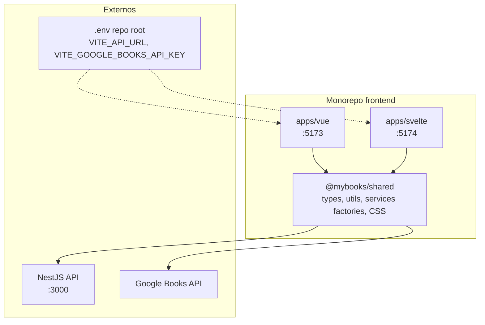

---

## Paquete compartido (`@mybooks/shared`)

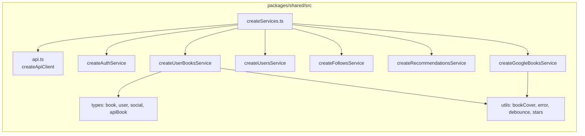

Cada app inyecta el token al crear los servicios:

- **Vue:** `getToken: () => token.value` en `apps/vue/src/services/instance.ts`
- **Svelte:** `getToken: () => get(token)` en `apps/svelte/src/services/instance.ts`

---

## Frontend Vue (`apps/vue`)

### Capas

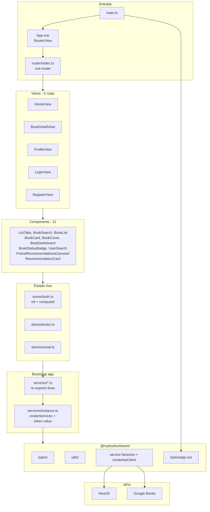

### Rutas y guardas

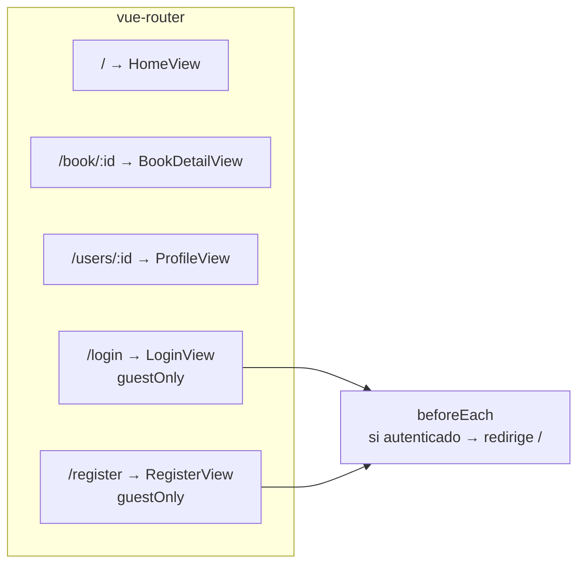

### Composición de HomeView

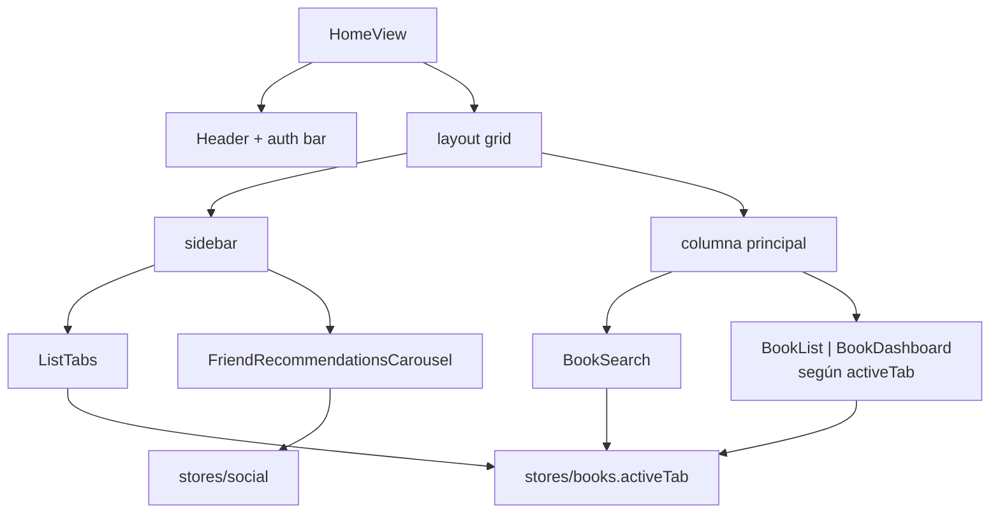

### Flujo: auth y libros

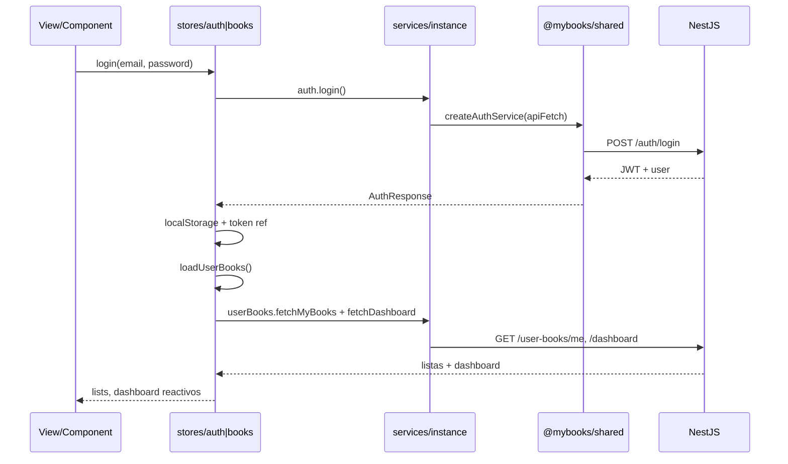

### Particularidades de Vue

| Elemento | Ubicación |
|----------|-----------|
| Router | `router/index.ts` (lazy imports) |
| Estado | `ref` / `computed` |
| Errores | refs locales y stores (sin toast global) |
| Init auth | restore desde `localStorage` en `main.ts` |

---

## Frontend Svelte (`apps/svelte`)

### Capas

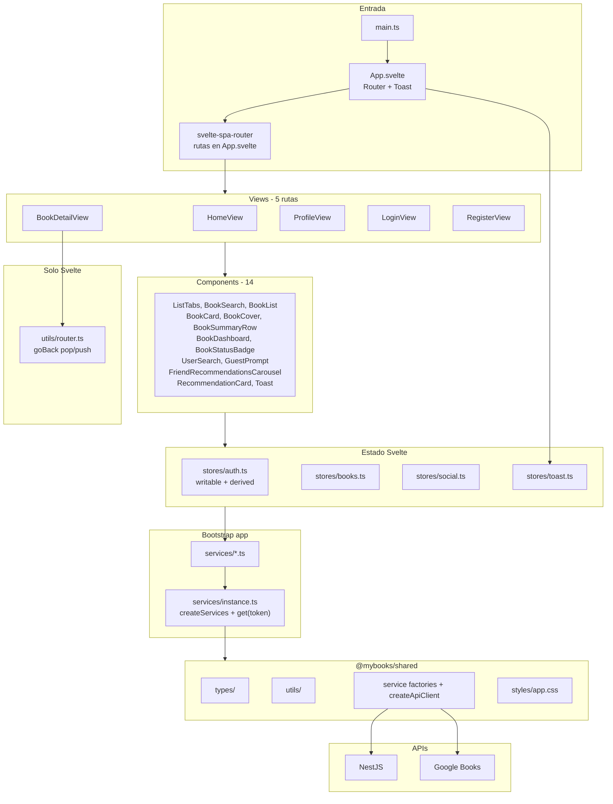

### Rutas y condiciones

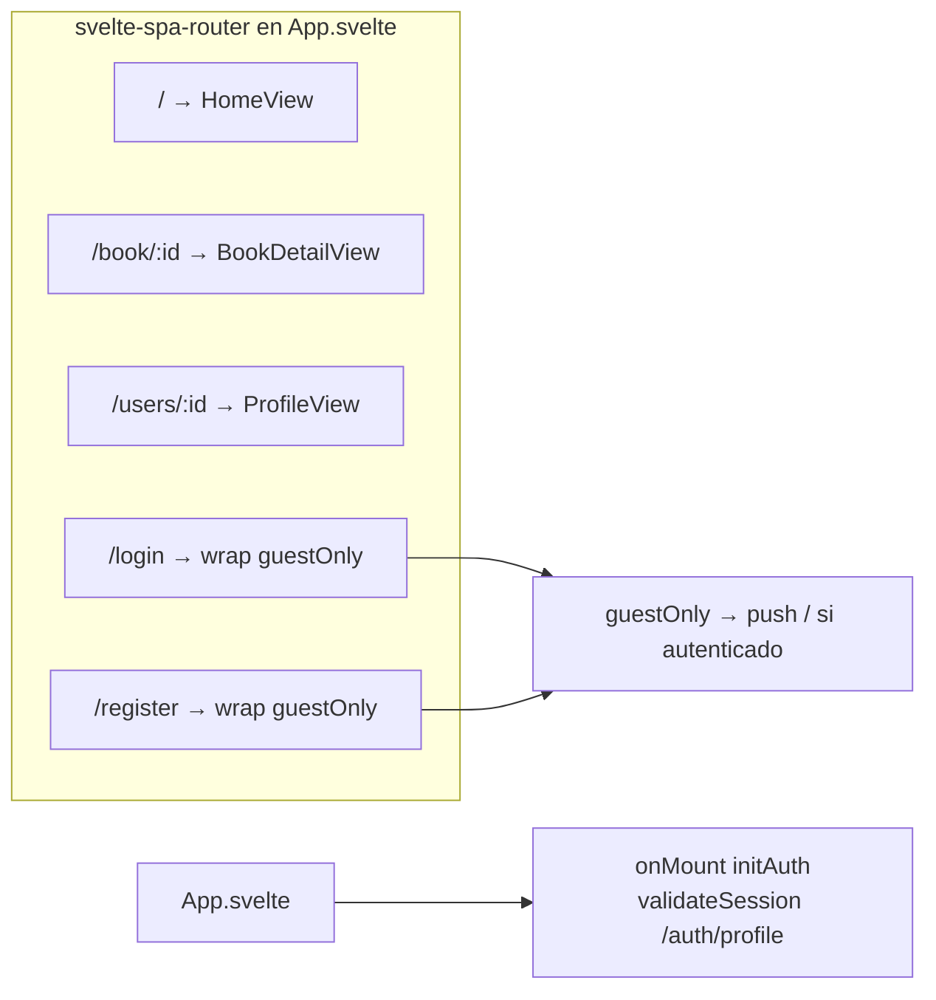

### Composición de HomeView

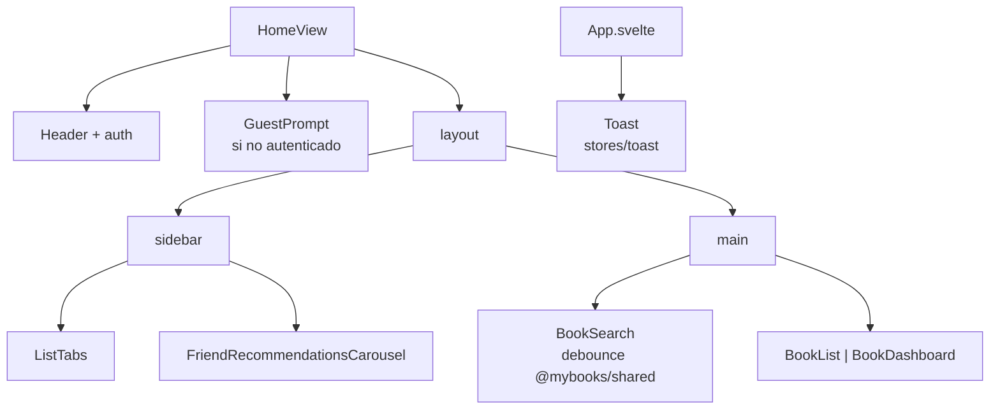

### Flujo: auth con validación de sesión

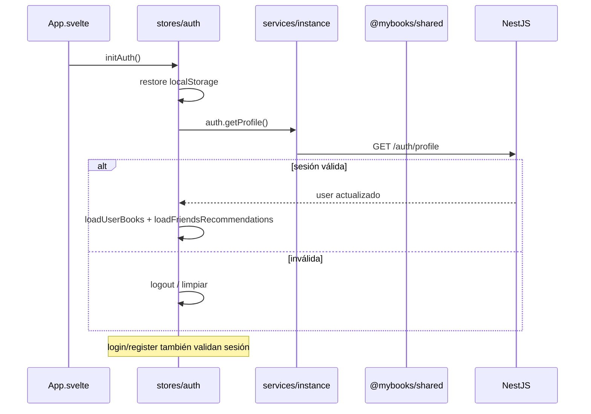

### Particularidades de Svelte

| Elemento | Ubicación |
|----------|-----------|
| Router | `App.svelte` + `svelte-spa-router` |
| Estado | `writable` / `derived` (`$store`) |
| Toast global | `stores/toast` + `Toast.svelte` |
| GuestPrompt | CTA para usuarios no autenticados |
| BookSummaryRow | fila título / autores / portada |
| goBack() | `utils/router.ts` (específico del framework) |

---

## Comparación Vue vs Svelte

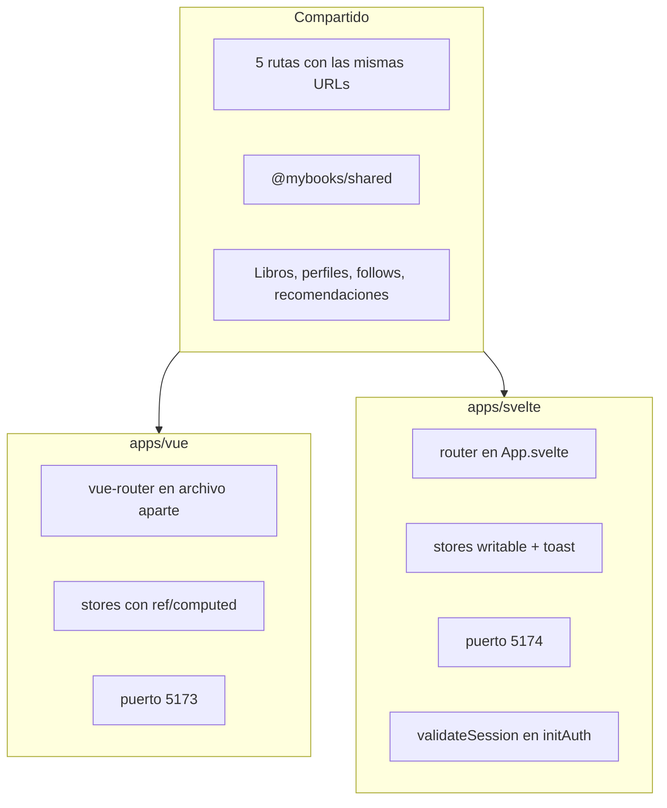

### Qué vive en cada capa

| Capa | `@mybooks/shared` | Cada app (`vue` / `svelte`) |
|------|-------------------|-----------------------------|
| Types, utils | Sí | No |
| Services HTTP | Sí (factories) | `services/instance.ts` + re-exports |
| Stores reactivos | No | Sí |
| Components / views | No | Sí |
| Router | No | Sí |
| CSS global | Sí (`styles/app.css`) | Import en `main.ts` |

---

## Estructura de carpetas

```
frontend/
├── package.json
├── pnpm-workspace.yaml
├── arquitectura.md          ← este documento
├── packages/
│   └── shared/
│       └── src/
│           ├── api.ts
│           ├── index.ts
│           ├── types/
│           ├── utils/
│           ├── services/
│           └── styles/app.css
└── apps/
    ├── vue/src/
    │   ├── main.ts, App.vue
    │   ├── router/
    │   ├── stores/
    │   ├── services/instance.ts
    │   ├── components/
    │   └── views/
    └── svelte/src/
        ├── main.ts, App.svelte
        ├── stores/
        ├── services/instance.ts
        ├── utils/router.ts
        ├── components/
        └── views/
```

---

## Comandos de desarrollo

```bash
cd frontend
pnpm install
pnpm dev          # Vue :5173 + Svelte :5174
pnpm dev:vue      # Solo Vue
pnpm dev:svelte   # Solo Svelte
```

Backend (aparte):

```bash
cd backend
npm run start:dev   # http://localhost:3000
```
